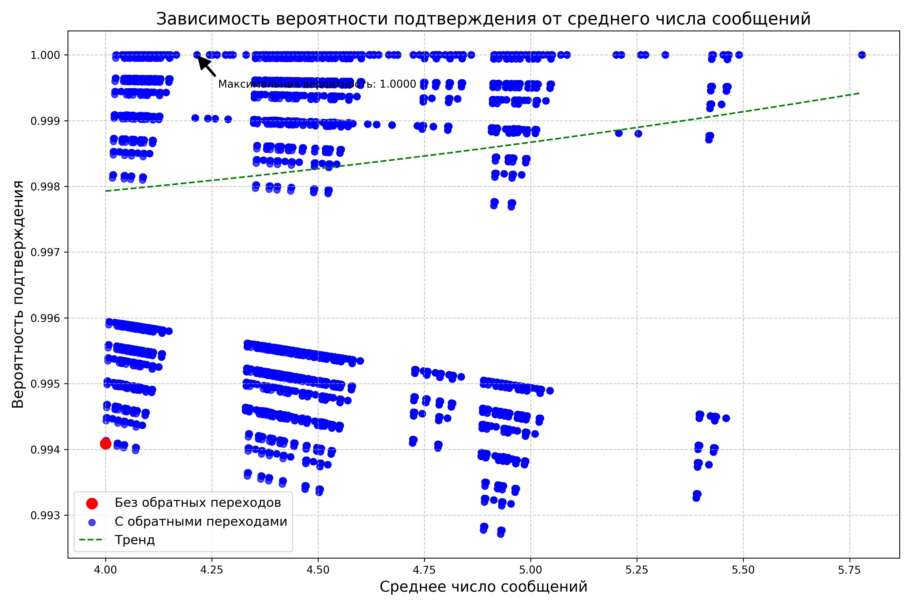

После запуска анализатора консенсуса без обратных переходов был получен следующий результат:

* Вероятность достижения консенсуса: **0.9941**
* Число сообщений: **4.0**

Анализ моделей с обратными переходами дал множество различных конфигураций с разной вероятностью успеха и средним числом сообщений.

# Анализ графика

Точки образуют несколько прямых линий с разным наклоном.

1. **Горизонтальная линия, близкая к y=1**:
   * Соответствует оптимальным стратегиям обратных переходов, которые фокусируются на ключевых организациях в консенсусе
   * Эти модели достигают максимальной надежности при минимальном увеличении коммуникационных затрат
2. **Наклонные линии с разной степенью убывания**:
   * Соответствуют моделям, где используются менее эффективные стратегии обратных переходов
   * Чем круче наклон линии, тем менее эффективны дополнительные сообщения для повышения вероятности успеха

Математически это объясняется формулой изменения вероятности при добавлении обратных переходов: P\_new = P\_old + (1 - P\_old) \* P\_retry

Где P\_old - исходная вероятность, P\_retry - вероятность успеха при повторной попытке, а среднее число сообщений увеличивается пропорционально (1 - P\_old). Это создает линейные зависимости для моделей с одинаковой базовой стратегией повторных попыток.

Но тренд возрастает, и это свидетельствует о повышении вероятности консенсуса с ростом числа сообщений, поскольку обратные переходы дают дополнительные шансы для достижения согласия, что логично.

Выбрана модель с id=1121322245, т.к. на ней достигается probability = 1.0, и expectedMessages достаточно маленький - 4.25. Есть гарантия достижения консенсуса.

# Анализ runTest.log

Консенсус был достигнут с помощью 4-х сообщений. Результат, зафиксированный в логе, полностью соответствует ожидаемому поведению системы на основе заданного правила консенсуса и вероятностей подтверждения.
